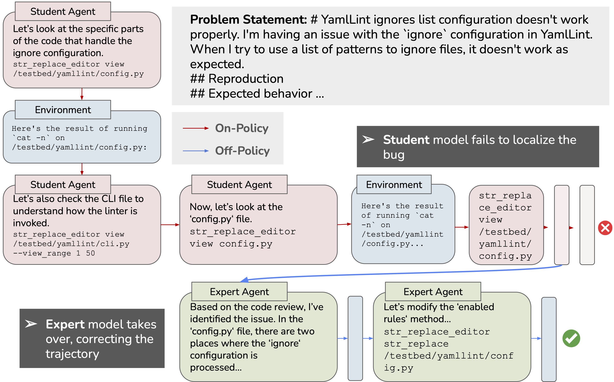

<figure style="text-align: center;">
  
</figure>

<hr />

# On-Policy Expert Corrections (OEC)

This repository provides code for generating *on-policy expert corrections (OEC)*, a pipeline for analyzing the covariate shift of multi-turn LM agents, and LLM-as-a-judge tools for analyzing agentic failure modes. On-policy expert corrections (OECs) are partially on-policy trajectories generated by starting rollouts with an on-policy student model and then switching to an expert model part way through the trajectory. Our experiments demonstrate that OECs help mitigate the problem of covariate shift in the setting of imitation learning for LM agents, resulting in more performant and robust LM agents.

## OEC Trajectory Generation Overview
Student models must be exposed via an inference server (e.g., vLLM); configure the correct hostnames and ports in `config/qwen32b_switch_claude_python_tools.yaml` before launching jobs.

- `test_oec.sh` runs a cheap sanity check using low-cost OpenAI models (see `config/openai_switching_test.yaml`) to validate the configuration before expensive runs.
- `generate_oec.sh` produces OEC trajectories with the configured switching schedule for 32B experiments in the paper.
- `eval_swesmith.sh` evaluates generated trajectories against unit test cases with the SWE-smith evaluation harness.
- `convert_to_sft.sh` converts trajectories into SFT-ready samples.

Training problem instances can be pulled directly from the [SWE-smith repository](https://github.com/SWE-bench/SWE-smith).

## Covariate Shift Analysis

The [`covariate_shift_analysis`](covariate_shift_analysis/) module embeds SWE-agent trajectories and measures distribution shifts between sets of trajectories to evaluate the degree of covariate shift. The subdirectory README explains the embedding strategy, plotting utilities, and how to reproduce the divergence figures.

## Failure Categorization

The [`failure_categorization`](failure_categorization/) module implements the LLM-as-judge pipeline for classifying trajectories into interpretable loss buckets. See the linked README for prompts, usage examples, and the categorization schema.

## Acknowledgements

This repo is a fork of the [SWE-agent](https://github.com/princeton-nlp/SWE-agent) project and relies heavily on datasets and infrastructure from [SWE-smith](https://github.com/SWE-bench/SWE-smith).

## License
MIT. Check `LICENSE` for more information.

## Citation

```bibtex
@inproceedings{yang2024sweagent,
  title={Imitation Learning for Multi-turn LM Agents via On-policy Expert Corrections},
  author={Niklas Lauffer and Xiang Deng and Srivatsa Kundurthy and Brad Kenstler and Jeff Da},
  year={2025},
}
```
